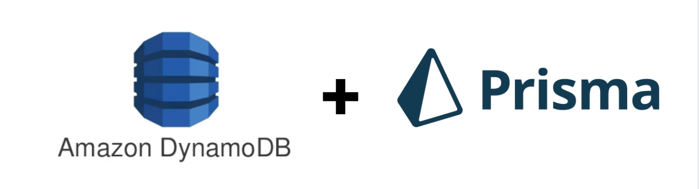

<p align="center">
  
</p>

<div align="center">
  <h1>Cosmox</h1>
  <a href="#"></a>
  <a href="#"></a>
  <a href="./LICENSE"></a>
  <br />
  <br />
</div>

> This is a type-safe ORM for Azure CosmosDB NoSQL, inpired by [Prisma.io](https://www.prisma.io/)

This package is for you if you're building data-driven applications and you're using Azure CosmosDB NoSQL as the main database.

If you're tired of writing raw SQL for querying Azure CosmosDB NoSQL database with complex filters, then this package is for you, too.

<p align="center">
  
  The code above gives you query auto-completion based on the data model you specified for each container in Azure CosmosDB
</p>

## 🤔 Use cases:

- Data analytics dashboard
- E-commerce
- IoT dashboard

## 🧠 Why Cosmox over `@azure/cosmos`?

- ✅ Type-safe advanced filtering
- 💪 Build-in SQL query-builder
- 🚀 Dynamic, type-safe field-selection - maximizing performance
- 🍃 No more hard-coding SQL queries, just bring your models

## 🚶‍♂️ How to get started?

Install this package

```shell
npm install cosmox
yarn install cosmox
pnpm install cosmox
```

Instantiate the client

```typescript
import { createClient } from 'cosmox';

type User = {
  id: string;
  firstName: string;
  lastName: string;
  age: number;
  createdAt: Date;
  isSuperAdmin: boolean;
};

type Post = {
  id: string;
  title: string;
  content: string;
  createdBy: string; // foreign key - User.id
};

// Example 1 - Using connection string
const orm = createClient({
  database: '<DATABASE_ID>',
  connectionString: '<DB_CONNECTION_STRING>',
  models: (t) => ({
    user: t.createModel<User>({ container: '<USER_CONTAINER_ID>' }),
    post: t.createModel<Post>({ container: '<POST_CONTAINER_ID>' }),
  }),
});

// Example 2 - Using CosmosDB client options
const orm = createClient({
  database: '<DATABASE_ID>',
  // same type-definition as "CosmosClientOptions" from "@azure/cosmos"
  cosmosClientOptions: {
    endpoint: '<EXAMPLE_ENDPOINT>',
  },
  models: (t) => ({
    user: t.createModel<User>({ container: '<USER_CONTAINER_ID>' }),
    post: t.createModel<Post>({ container: '<POST_CONTAINER_ID>' }),
  }),
});
```

Make queries with simple filters

```typescript
const getFilteredUsers = async () => {
  return await orm.user.findMany({
    where: { firstName: { contains: 'Sam' } },
  });
};

const getFilteredUsers = async () => {
  return await orm.user.findMany({
    where: { age: { gte: 18 } },
  });
};

const getFilteredUsers = async () => {
  return await orm.user.findMany({
    where: { createdAt: { gte: new Date('2024-01-01') } },
  });
};

const getFilteredposts = async () => {
  return await orm.post.findMany({
    where: { createdBy: { equals: '<SOME_USER_ID>' } },
  });
};
```

Make a query without any filters

```typescript
// This will return maximum of 100 items by default
const result = orm.user.findMany({});
```

Or, make a query by applying some complex filters, field-selections, and pagination logic:

```typescript
const getFilteredUsers = async () => {
  return await orm.user.findMany({
    where: {
      firstName: {
        startsWith: 'Sa',
        endsWith: 'lyn',
        mode: 'INSENSITIVE',
      },
      age: {
        lte: 20,
        gte: 10,
        not: 15,
      },
      isSuperAdmin: {
        not: true,
      },
      createdAt: {
        lte: new Date('2024-12-31'),
        gte: new Date('2024-12-01'),
        not: new Date('2024-12-15'),
      },
    },
    orderBy: {
      firstName: 'ASC',
    },
    take: 10,
    select: {
      id: true,
      firstName: true,
      age: true,
    },
    nextCursor: '<PAGINATION_TOKEN>',
  });
};
```

Find an item by ID

```typescript
// without field-selection
const result = orm.user.findOne({
  where: { id: 'USER_ID' },
});

// with field-selection
const result = orm.user.findOne<User>({
  where: { id: 'USER_ID' },
  select: { id: true, firstName: true },
});
```

Create an item

```typescript
type CreateUserInput = Partial<User>;

const result = orm.user.create<CreateUserInput>({
  data: {
    firstName: '<FIRST_NAME>',
    lastName: '<LAST_NAME>',
  },
});
```

Update an item

```typescript
type UpdateUserInput = Partial<User>;

const result = orm.user.update<UpdateUserInput>({
  where: { id: '<USER_ID>' },
  data: {
    firstName: '<UPDATED_FIRST_NAME>',
  },
});
```

Delete an item

```typescript
const result = orm.user.delete({
  where: { id: '<USER_ID>' },
});
```

## 😀 Roadmap

- ~~Core Query builder~~
- Bulk create / update operations
- Observability - query logging
- Filtering on more complex data types such as enums, enum arrays, string arrays & number arrays
